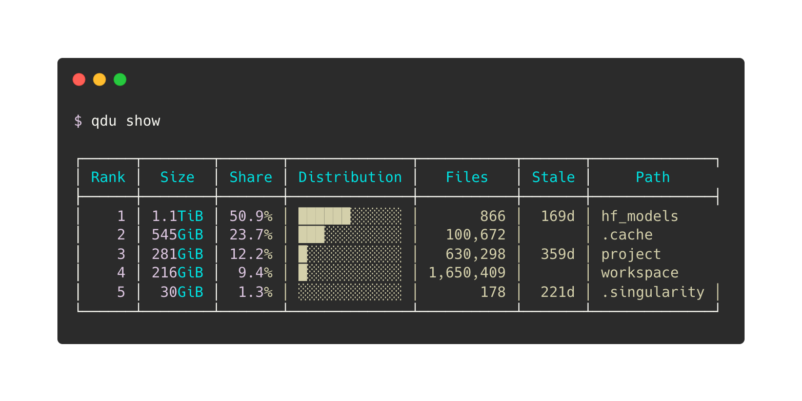

# qdu

[English](README.md) | 日本語



ディスクの空き容量が減ってきた。けれど、どこを片付ければよいのか分からない。

`qdu`（quick `du`）は、そのようなときに使うコマンドラインツールです。名前には、容量の大きな領域でも、保存した情報を使ってディスク使用量を素早く確認できるようにする、という意味を込めています。

ディレクトリの使用量を「スナップショット」として保存するため、毎回すべてを調べ直さなくても、現在の容量ランキングや前回からの増減をあとからすぐに確認できます。

```bash
qdu snapshot   # 現在の状態を記録する
qdu show       # 容量が大きい場所を確認する
qdu diff       # 前回から増減した場所を確認する
```

`sudo`は必要ありません。一般ユーザーが読み取れる範囲を走査し、読めなかった場所はエラーとして記録します。

## 主な機能

- ディレクトリ容量のスナップショットを保存
- 前回からの増減量をランキング表示
- ユーザーごとの容量・inode使用量を集計
- 大容量ファイルやinodeを多く使う場所を表示
- 長期間更新されていないディレクトリ・ファイルを色付きで警告
- 運用上の許容量に対する使用率と超過量を表示
- 複数の走査対象をプロファイルで管理
- autofsやNFSなど、別ファイルシステムを含む走査
- 表、TSV、JSONで出力
- スナップショットの検証、修復、圧縮

## 動作環境

- LinuxまたはmacOS
- Python 3.10〜3.14
- 追加のPythonパッケージは不要

`qdu browse`を使う場合だけ、別途[`fzf`](https://github.com/junegunn/fzf)が必要です。

Pythonのバージョンは、次のコマンドで確認できます。

```bash
python3 --version
```

## インストール

配布用の実行ファイル`dist/qdu`を、一般ユーザーが書き込める`~/.local/bin`へ配置します。

```bash
mkdir -p "$HOME/.local/bin"
install -m 755 ./dist/qdu "$HOME/.local/bin/qdu"
```

確認します。

```bash
command -v qdu
qdu --version
```

`command -v qdu`で何も表示されない場合は、現在のターミナルで`PATH`を追加してください。

```bash
export PATH="$HOME/.local/bin:$PATH"
```

インストールスクリプトを使う場合は、リポジトリのルートで次を実行します。

```bash
./install.sh
```

詳しいインストール方法とビルド方法は、[導入ガイド](docs/GETTING_STARTED_ja.md)を参照してください。

## まずは3つのコマンドを試す

### 1. 現在の状態を記録する

```bash
qdu snapshot
```

何も指定しない場合は、自分のホームディレクトリを走査します。

qduが保存するのは、容量、ファイル数、inode数、取得日時などの情報です。ファイルの内容そのものはコピーしません。

### 2. 容量ランキングを見る

```bash
qdu show
```

深さ2までの上位30件を見る場合：

```bash
qdu show --max-depth 2 --top 30
```

### 3. 後でもう一度記録し、差分を見る

```bash
qdu snapshot
qdu diff
```

増えた場所だけを見る場合：

```bash
qdu diff --growth-only
```

`qdu diff`には、完全なスナップショットが2つ以上必要です。

## 複数の場所を管理する

走査対象と設定は、**プロファイル**という名前で分けられます。

```bash
qdu profile add project-data --path /data/my-project

qdu snapshot --profile project-data
qdu show --profile project-data
qdu diff --profile project-data
```

`--profile`を指定しない場合は、`default`プロファイルが使われます。

プロファイル名には英数字、`.`、`_`、`-`だけを使用できます。絶対パス、`..`、パス区切り文字を含む名前は、状態ディレクトリ外へのアクセスを防ぐため拒否されます。

`/home`がautofsで、各ユーザーのホームが別のNFSマウントになっている環境では、別ファイルシステムを含める設定が必要です。

```bash
qdu profile add shared-home \
  --path /home \
  --cross-filesystems \
  --with-users
```

詳しくは、[スナップショットと走査範囲](docs/SNAPSHOTS_AND_SCANNING_ja.md)を参照してください。

## よく使う分析

### 長期間更新されていない場所を探す

```bash
qdu show --stale
qdu show --stale-only 90 --max-depth 4 --top 100
```

### 運用上の許容量を確認する

```bash
qdu show --capacity-limit 2TiB
```

共有領域から自分の使用量だけを確認する場合：

```bash
qdu show \
  --profile shared-home \
  --capacity-limit 2TiB \
  --capacity-user "$USER"
```

### 大容量ファイルやinodeを確認する

```bash
qdu files --top 30
qdu inodes --max-depth 3 --top 30
```

詳しい使い方は、[分析ガイド](docs/ANALYSIS_GUIDE_ja.md)を参照してください。

## データの保存場所

設定ファイル：

```text
${XDG_CONFIG_HOME:-$HOME/.config}/qdu/config.ini
```

スナップショットと履歴：

```text
${XDG_STATE_HOME:-$HOME/.local/state}/qdu/profiles/<profile>/
```

保存内容や設定ファイルの詳細は、[設定と保存場所](docs/CONFIGURATION_AND_STORAGE_ja.md)を参照してください。

## ドキュメント

| 文書 | 内容 |
|---|---|
| [ドキュメント一覧](docs/README_ja.md) | 目的に合う文書を探す |
| [導入ガイド](docs/GETTING_STARTED_ja.md) | インストール、基本用語、最初の操作 |
| [スナップショットと走査範囲](docs/SNAPSHOTS_AND_SCANNING_ja.md) | 権限、除外、NFS、autofs、マウントポイント |
| [分析ガイド](docs/ANALYSIS_GUIDE_ja.md) | 容量、差分、放置候補、許容量、ユーザー、ファイル、inode |
| [設定と保存場所](docs/CONFIGURATION_AND_STORAGE_ja.md) | 設定ファイル、プロファイル、状態データ |
| [運用と保守](docs/OPERATIONS_ja.md) | 検証、修復、圧縮、しきい値、定期実行、終了コード |
| [トラブルシューティング](docs/TROUBLESHOOTING_ja.md) | よくあるエラーと確認手順 |
| [コマンドリファレンス](docs/COMMAND_REFERENCE_ja.md) | 全コマンドと各オプションの既定値 |
| [開発者向けガイド](docs/DEVELOPMENT_ja.md) | テスト、ビルド、ベンチマーク、構成 |
| [tmuxによる週次実行](docs/QDU_TMUX_WEEKLY_SNAPSHOT_GUIDE_ja.md) | cronを使えない環境での定期実行 |

英語版は[English documentation index](docs/README.md)から参照できます。

## コマンド一覧

| コマンド | 役割 |
|---|---|
| `qdu snapshot` | スナップショットを取得 |
| `qdu show` | 容量ランキングを表示 |
| `qdu diff` | スナップショットを比較 |
| `qdu list` | 履歴一覧を表示 |
| `qdu users` | ユーザー別ランキングを表示 |
| `qdu errors` | 読めなかった場所を表示 |
| `qdu files` | 大容量ファイルを表示 |
| `qdu inodes` | inode使用量を表示 |
| `qdu explain` | 1つのディレクトリを掘り下げる |
| `qdu browse` | `fzf`でディレクトリを選ぶ |
| `qdu check` | 容量・使用率のしきい値を判定 |
| `qdu compact` | 古いスナップショットを圧縮 |
| `qdu verify` | スナップショットを検証 |
| `qdu doctor` | 実行環境を診断 |
| `qdu repair` | インデックスを再構築 |
| `qdu unlock` | 残ったロック情報を削除 |
| `qdu profile` | プロファイルを管理 |
| `qdu config` | 設定を管理 |

全オプションは`--help`または[コマンドリファレンス](docs/COMMAND_REFERENCE_ja.md)で確認できます。

```bash
qdu --help
qdu snapshot --help
qdu show --help
qdu diff --help
```
